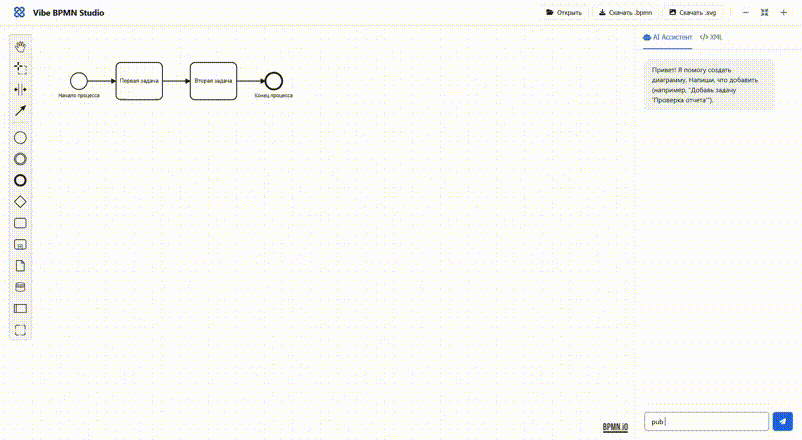

# Vibe BPMN Studio

<p align="center">
  
</p>

[](https://python.org)
[](https://fastapi.tiangolo.com/)
[](LICENSE)

A modern web application for creating, viewing, and editing BPMN diagrams (Business Process Model and Notation) with AI-powered assistant.

## Table of Contents

- [Features](#features)
- [Quick Start](#quick-start)
- [Usage](#usage)
- [API Endpoints](#api-endpoints)
- [Project Structure](#project-structure)
- [Architecture](#architecture)
- [CI/CD](#cicd-pipeline)
- [Contributing](#contributing)
- [License](#license)

## Features

- **Diagram Creation**: Intuitive editor with a palette of elements
- **AI Assistant**: Chat-based BPMN generation and editing help
- **Diagram Viewing**: Quick preview of BPMN diagrams with zoom capabilities
- **Data Import**: Upload diagrams from files (.bpmn, .xml) or load examples
- **Export**: Save diagrams in SVG and BPMN formats
- **Real-time Editing**: Edit your BPMN in real time
- **Navigation**: Zoom, fit-to-screen, and pan functionality
- **Modern UI**: Clean, professional interface with dark theme code editor

## Technologies

- **Backend**: Python, FastAPI, Uvicorn
- **Frontend**: HTML5, CSS3, JavaScript (ES6+)
- **BPMN Library**: bpmn-js v14.0.0
- **Styling**: Modern CSS with Custom Properties
- **Package Manager**: UV (modern Python package manager)
- **CI/CD**: GitHub Actions with Docker integration
- **Code Quality**: ruff linter, Hadolint for Docker files
- **AI**: LangGraph + OpenRouter / GenAI free tier models

## Quick Start

### Prerequisites

- Python 3.13 or higher
- UV package manager (recommended) or pip

### Installation

```bash
# Clone the repository
git clone <repository-url>
cd vibe-bpmn-studio

# Install dependencies with UV
uv sync

# Or with pip
pip install -e .
```

### Running

```bash
# With uvicorn
uvicorn main:app --reload --host 0.0.0.0 --port 8000
```

Navigate to `http://localhost:8000` in your browser.

### Docker

```bash
# Pull the Docker image
docker pull pigstep/vibe-bpmn:latest

# Run the container
docker run -d -p 8000:8000 --name vibe-bpmn-studio pigstep/vibe-bpmn:latest
```

## Usage

### Working with AI Assistant

- Navigate to **AI Assistant** tab in the sidebar
- Type your request in natural language (e.g., "Add task 'Review Document'")
- AI will help generate and modify BPMN diagrams
- Example: "Create a process chain of Touristic company"

AI generation powered by LangGraph and OpenRouter free tier model for intelligent BPMN creation.

### Diagram Upload

**From File:**

- Click **Open** button in the toolbar
- Select a .bpmn or .xml file
- Diagram will load automatically

**From XML Editor:**

- Navigate to **XML** tab in the sidebar
- Paste BPMN XML into the code editor
- Click **Apply** to load the diagram

### Editing

- Use the toolbar buttons for zoom controls
- The interface supports both view and edit modes
- Changes are reflected in real-time

### Export

- **Download .bpmn**: Save as BPMN format for further editing
- **Download .svg**: Download as vector image for presentations

### Example BPMN

The application loads with a sample diagram that includes:

- Start event
- Two tasks
- End event
- Sequential flows

## Project Structure

```
vibe-bpmn-studio/
├── src/                        # Python source code
│   ├── api_routes.py           # FastAPI routes
│   ├── get_example_diagram.py  # Example diagram loader
│   ├── schemas.py              # Pydantic schemas
│   ├── ai_generation/          # AI agent (LangGraph)
│   │   ├── llm_client.py       # OpenAI LLM client
│   │   ├── promts.py           # System prompts
│   │   └── bpmn_agent/         # BPMN generation agent
│   │       └── simple/         # Simple agent implementation
│   │           ├── agent.py    # Main agent logic
│   │           ├── state.py    # Agent state
│   │           └── get_bpmn_node.py
│   └── assemblers/             # XML/JSON generators
│       ├── xml/                # XML assembly
│       │   ├── base_xml.py     # Base XML builder
│       │   ├── bpmn.py         # BPMN XML assembler
│       │   └── director.py     # XML director
│       └── json/               # JSON assembly
│           ├── base.py         # Base JSON assembler
│           └── bpmn.py         # BPMN JSON assembler
├── static/                     # Frontend assets
│   ├── index.html              # Main application interface
│   ├── css/
│   │   └── style.css           # Modern styling
│   └── js/                     # JavaScript modules
│       ├── app.js              # Main application logic
│       ├── bpmn-viewer.js      # BPMN viewer management
│       ├── bpmn-controls.js    # File operations
│       ├── bot-responder.js    # AI assistant logic
│       └── ui-manager.js       # UI management
├── data/                       # Data files
│   ├── XMLs/                   # BPMN XML templates
│   └── bpmn_schemas/           # JSON schemas for BPMN
├── main.py                     # FastAPI application entry point
├── pyproject.toml              # Python project configuration
├── settings.py                 # Application settings
└── README.md                   # Project documentation
```

## Architecture

```
┌─────────────────────────────────────┐
│  Frontend (bpmn-js)                 │
│  - BPMN visualization               │
│  - Interactive editing              │
│  - UI for AI-assistant              │
└──────────────┬──────────────────────┘
               │ REST API
┌──────────────▼──────────────────────┐
│  Backend (FastAPI)                  │
│  - API routes                      │
│  - XML/JSON assemblers             │
└──────────────┬──────────────────────┘
               │
┌──────────────▼──────────────────────┐
│  AI Layer (LangGraph + OpenAI)     │
│  - BPMN agent with state machine    │
│  - LLM for natural language → BPMN │
└─────────────────────────────────────┘
```

## CI/CD Pipeline

This project features a comprehensive CI/CD setup with GitHub Actions:

### Automated Workflows

- **Continuous Integration**:
  - Docker image building and testing
  - Python code linting with ruff
  - Docker file validation with Hadolint
- **Continuous Deployment**:
  - Automated Docker image pushes
  - Multi-stage deployment pipeline
  - Automated testing on every push

### Available Workflows

1. `ci-docker-build.yml` - Builds and tests Docker images
2. `ruff_linter.yml` - Python code quality checks
3. `docker_hadolint.yml` - Docker file security and best practices validation
4. `cd-docker-push.yml` - Automated Docker image deployment
5. `cd-render-push.yml` - Static site deployment pipeline

### Benefits

- Automatic testing on every commit
- Code quality enforcement
- Secure Docker practices
- One-click deployment
- Consistent development environment

## API Endpoints

### GET /

Main application page serving the React interface

### GET /health

Health check endpoint

- **Response**: `{"status": "OK"}`

### GET /api/example-bpmn-xml

Get the base BPMN XML structure

- **Response**: `{"xml": "<bpmn:definitions>..."}`

### GET /api/generate?user_input=

Generate BPMN XML code using AI

- **Parameters**: `user_input` (string) - Text description of the process
- **Response**: `{"output": "<bpmn:definitions>..."}`
- **Note**: Powered by LangGraph agent with OpenRouter free tier models

## Requirements

- Requires an internet connection to load the bpmn-js library
- Large diagrams may load slowly
- No built-in server-side persistence

## Contributing

1. Fork the repository
2. Create a feature branch (`git checkout -b feature/AmazingFeature`)
3. Commit changes (`git commit -m 'Add some AmazingFeature'`)
4. Push the branch (`git push origin feature/AmazingFeature`)
5. Open a Pull Request

## License

This project is released under the MIT license. See the [LICENSE](LICENSE) file for details.

---

Last Updated: January 2026
